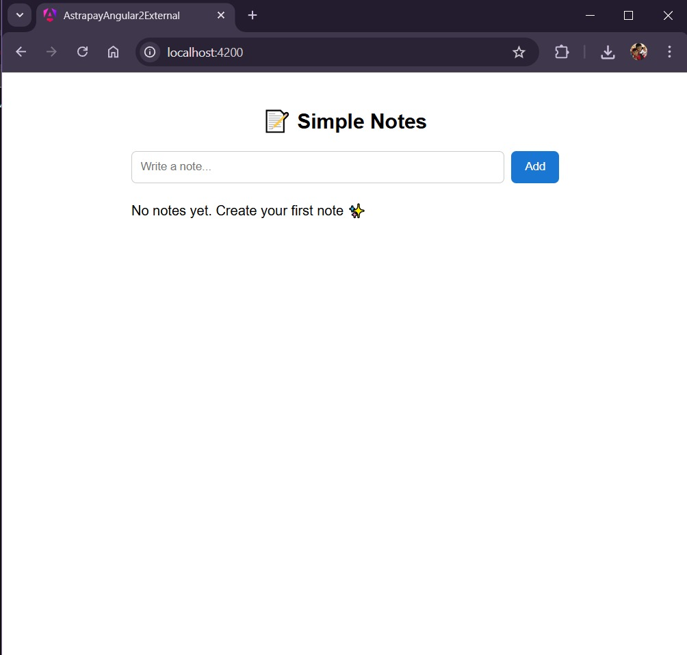
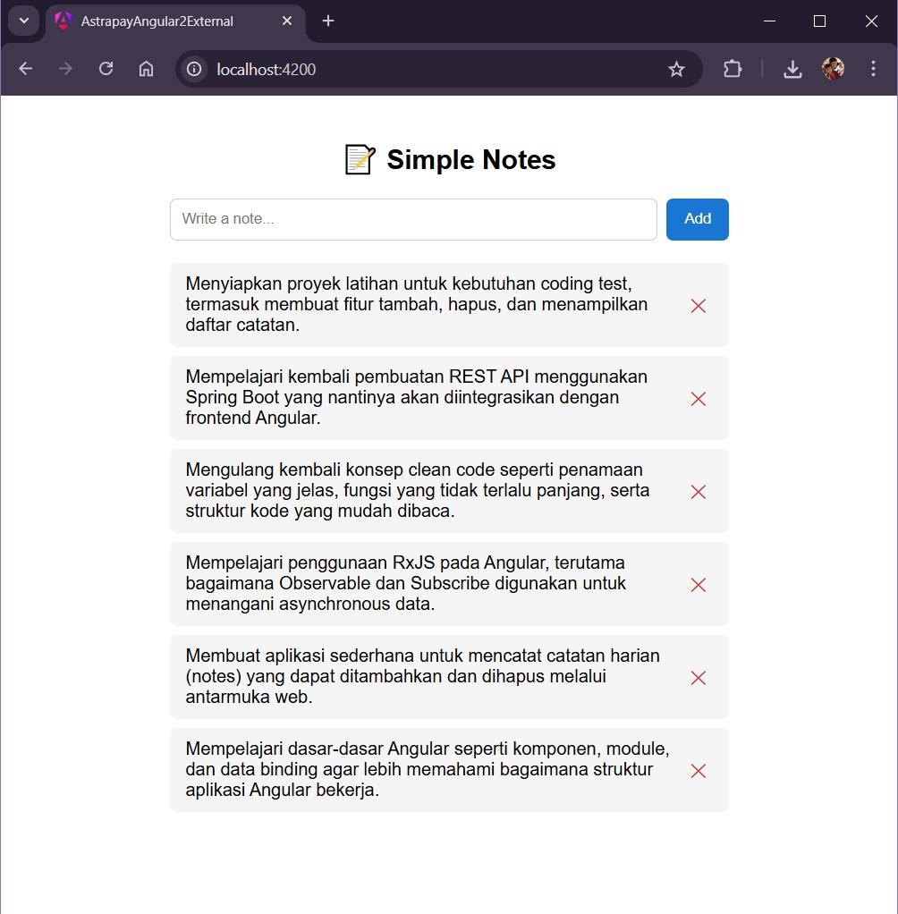

# Angular Astrapay External Project

Berikut adalah project Angular untuk aplikasi external AstraPay, yang sesuai dengan konvensi yang digunakan pada AstraPay.

## Development Server

Untuk menjalankan development server, jalankan:

```bash
ng serve
```

Setelah server berjalan, buka browser dan navigasi ke `http://localhost:4200/`. Aplikasi akan otomatis reload setiap kali ada perubahan pada source file.

> **Catatan:** Project ini menggunakan proxy untuk menghindari CORS. Konfigurasi proxy ada di `proxy.conf.json` dan sudah terdaftar di `angular.json`, sehingga aktif otomatis saat `ng serve`.

## Build

Untuk build project, jalankan:

```bash
ng build
```

Hasil build akan tersimpan di direktori `dist/`.

## Running Unit Tests

Untuk menjalankan unit test dengan [Vitest](https://vitest.dev/):

```bash
ng test
```

## Package Structure

```
src
 +- app
     +- app.ts
     +- app.html
     +- app.css
     +- app-module.ts
     +- app-routing-module.ts
     |
     +- models
     |   +- [Name].model.ts
     |
     +- pages
     |   +- [feature-name]
     |       +- [feature-name].component.ts
     |       +- [feature-name].component.html
     |       +- [feature-name].component.css
     |
     +- services
         +- [Name].service.ts
```

## Models

Model adalah interface TypeScript yang merepresentasikan struktur data dari backend. Setiap file model harus diakhiri dengan `.model.ts`.

Buat interface terpisah untuk request dan response jika strukturnya berbeda.

Contoh:

```typescript
export interface Note {
  id: number;
  content: string;
}

export interface CreateNoteRequest {
  content: string;
}
```

## Pages (Components)

Folder `pages` berisi komponen Angular yang merepresentasikan halaman/fitur. Setiap komponen harus bersifat **standalone** dan menggunakan `imports` untuk mendeklarasikan dependensi module-nya sendiri.

Penamaan folder dan file menggunakan kebab-case dan diakhiri dengan `.component.ts`.

Contoh:

```typescript
@Component({
  selector: 'app-notes',
  standalone: false,
  templateUrl: './notes.component.html',
  styleUrls: ['./notes.component.css'],
})
export class NotesComponent implements OnInit {
  notes: Note[] = [];
  content = '';
  loading = false;
  error = '';

  constructor(private noteService: NoteService) {}

  ngOnInit(): void {
    this.load();
  }
}
```

Aturan:
- Gunakan `standalone: false` sesuai konvensi project (dikonfigurasi di `angular.json` schematics)
- Daftarkan komponen di `declarations` pada `AppModule`
- Module seperti `CommonModule`, `FormsModule` cukup didaftarkan sekali di `AppModule` imports, tidak perlu di tiap komponen

## Services

Folder `services` berisi class Angular service yang bertanggung jawab untuk komunikasi dengan backend API melalui `HttpClient`.

Setiap nama service harus diakhiri dengan `Service`, contoh `NoteService`.

Ketika sebuah service hanya memiliki **1 (satu)** implementasi konkrit maka **tidak perlu membuat interface**. Membuat interface hanya untuk satu implementasi seperti `NoteServiceImpl` adalah anti-pattern.

Contoh:

```typescript
@Injectable({ providedIn: 'root' })
export class NoteService {
  private readonly baseUrl = '/api/notes';

  constructor(private http: HttpClient) {}

  getNotes(): Observable<Note[]> {
    return this.http.get<Note[]>(this.baseUrl);
  }

  createNote(payload: CreateNoteRequest): Observable<Note> {
    return this.http.post<Note>(this.baseUrl, payload);
  }

  deleteNote(id: number): Observable<void> {
    return this.http.delete<void>(`${this.baseUrl}/${id}`);
  }
}
```

Aturan:
- Gunakan `providedIn: 'root'` agar service tersedia secara global tanpa perlu mendaftarkan di module
- Gunakan **relative URL** (contoh `/api/notes`) agar request melewati proxy
- Jangan hardcode URL absolut ke backend di service

## Routing

Routing dikonfigurasi di `app-routing-module.ts`. Setiap komponen halaman baru harus didaftarkan di sini.

Contoh:

```typescript
const routes: Routes = [
  { path: '', component: NotesComponent },
  { path: 'notes', component: NotesComponent }
];
```

## Proxy Configuration

Untuk menghindari CORS saat development, project ini menggunakan Angular dev server proxy. Konfigurasi ada di `proxy.conf.json`:

```json
{
  "/api": {
    "target": "http://localhost:8000",
    "secure": false,
    "changeOrigin": true
  }
}
```

Dengan konfigurasi ini, semua request ke `/api/*` dari Angular akan di-forward ke `http://localhost:8000/api/*`. Proxy sudah terdaftar di `angular.json` sehingga aktif otomatis saat `ng serve`.

> **Penting:** Proxy hanya berfungsi di development server. Untuk production, konfigurasi CORS harus dihandle di sisi backend atau reverse proxy (nginx, dll).


## Application Screenshots

### 1. Tampilan List Kosong


### 2. Tampilan 6 Notes
